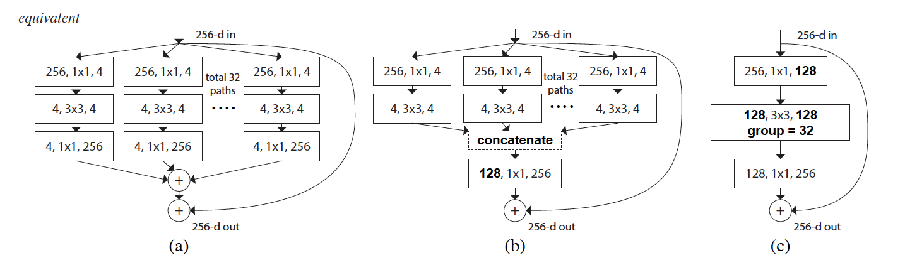

The fundamental problem that the authors ask their readers to think of is how to solve the "depth vs width" problem in designing deep neural networks. To this end, the authors design a new hyper-parameter $C$, called **Cardinality** which is the size of a set of transformations applied on any input to a block of a neural network and introduce this as an essential component independent of depth or width of models.

Drawing parallels to [InceptionNet](https://arxiv.org/abs/1409.4842) and neurons that compute inner products, the authors adopt a *split*-*transform*-*aggregate* strategy, but in a more simple and extensible form. A module (block) in the designed network performs a set of transformations, each on a low-dimensional embedding, whose outputs are aggregated by summation. The idea to make it simple is to use the same set of transformations in a block which can be aggregated easily. This allows us the flexibility to use any set of transformations in a given block to achieve the desired goal.

A representation of a ResNext block is shown below. The term *Next* is used to highlight the introduction of the hyper-parameter $C$.

An important result of using similar transformations is that the computations can be simplified. Looking at the above figure, we can see how the rather complex representation in [a] can be easily devolved to the representation in [c], where [group convolutions](http://colah.github.io/posts/2014-12-Groups-Convolution/) are being used to denote the $C$ parameter.

The authors are able to show that using $C=32$ and $d=4$ in bottleneck computation [first block in any transformation in represenation a above], they were able to keep almost similar parameters as a ResNet model and improve performance on several benchmarks, including ImageNet-1K, COCO and ImageNet-5K.

### References

1. Xie, Saining, et al. "Aggregated residual transformations for deep neural networks." Computer Vision and Pattern Recognition (CVPR), 2017 IEEE Conference on. IEEE, 2017.  
2. Szegedy, Christian, et al. "Going deeper with convolutions." Proceedings of the IEEE conference on computer vision and pattern recognition. 2015.
3. He, Kaiming, et al. "Deep residual learning for image recognition." Proceedings of the IEEE conference on computer vision and pattern recognition. 2016.