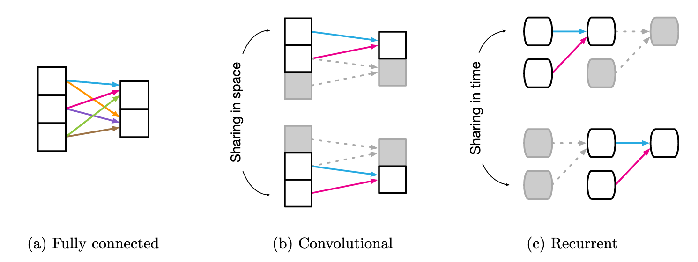
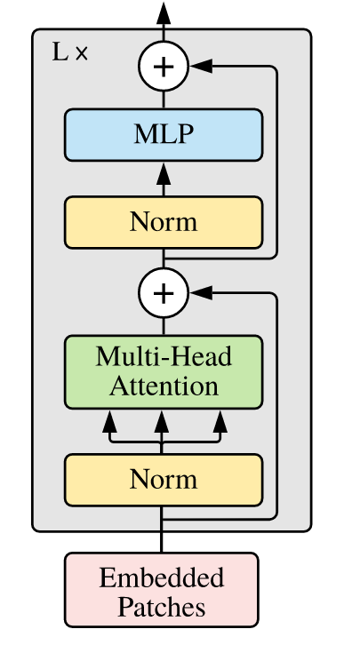
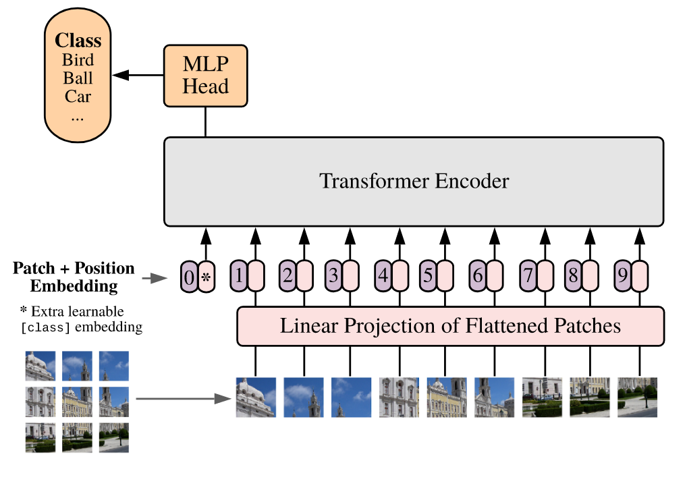
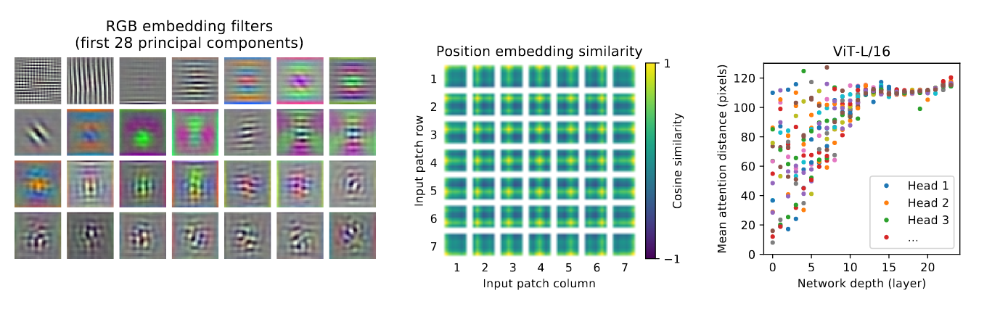

Training overparameterized convolutional neural networks (CNNs) with gradient-based methods have been the de-facto method for learning good representations of images for tasks such as recognition, object detection, and segmentation. There has been a great success in this space, with deeper and wider models achieving state-of-art results [1,2,3]. One of the primary reasons that CNNs have done so well is because of the inherent *inductive bias* these models encode.

## Inductive Bias - A Refresher

Before we can talk about inductive biases, let's think about weight reuse and sharing in common deep learning building blocks.

Weight Sharing for different building blocks. Image taken from [4]. Shared weights are indicated using the same color.

We see that Fully connected layers, have all independent weights and there is no sharing. Convolutional layers have local kernel functions, which are reused multiple times across the input. Recurrent layers reuse the same function across different processing steps.

Inductive bias can be thought of as an equivalent of weight sharing. An inductive bias allows a learning algorithm to prioritize one solution or interpretation over another, independent of the observed data. 

For example, in a Bayesian model, the inductive bias is typically expressed through the choice and parameterization of the prior distribution. In other contexts, an inductive bias might be a regularization term added to avoid overfitting, or it might be encoded in the architecture of the algorithm itself.

An inductive bias can also be thought of as an infinitely strong prior. An *infinitely strong prior* places zero probability on some parameters and says that these parameters values are completely forbidden, regardless of how much support the data gives to those values. Section 9.4 in [5] goes over how convolutions and pooling act as infinitely strong priors.

So what inductive bias do these building blocks end up encoding? Let's have a peak

|    Component    |    Entities   |  Relations | Relative Inductive Bias |      Invariance     |
|:---------------:|:-------------:|:----------:|:-----------------------:|:-------------------:|
| Fully connected |     Units     | All-to-all |           Weak          |          -          |
|  Convolutional  | Grid Elements |    Local   |         Locality        | Spatial Translation |
|    Recurrent    |   Timesteps   | Sequential |      Sequentiality      |   Time Translation  |

And it is this very __translation equivariance__ and __locality__ that have allowed for the great success of CNNs. 

## Transformer Block - A Refresher

Self-attention based architectures, in particular, Transformers[6] have become the model of choice in natural language processing. The dominant approach is to pre-train on a large text corpus and then fine-tune on a smaller task-specific dataset[7]. The building blocks of these transformers are computationally efficient and scalable, with recent models scaling up to 200B [8] and 600B [9] parameters.

Transformer Encoder Layer

Inspired by the success here, there have been attempts to combine CNN-like architectures with self-attention [10,11], with some replacing convolutions entirely [12,13]. The latter models, while theoretically efficient, have not yet been scaled effectively on modern hardware accelerators due to the use of specialized attention patterns. And hence, CNNs remain the architecture of choice for the image space.

## Data priors' win over Inductive Bias - The Vision Transformer

ICRL 2021 saw a large number of submissions, one of which has caught everyone's eye is the Vision Transformer (ViT) [14]. The paper showed the first highly successful model which can use the vanilla transformer model, without any special adaptation of self-attention for the image recognition problem. The model is visualized in the image below.

Vision Transformer (ViT)

### The Model

To handle 2D images, the vision transformer (__ViT__) reshapes an image $x \in \mathbb{R}^{H \times W \times C}$ into a sequence of flattened 2D patches $x_p \in \mathbb{R}^{N \times (P^2 .C)}$. Here $(H, W)$ is the resolution of the original image, and $(P, P)$ is the resolution of each image patch. $N = HW / P^2$ is then the effective sequence length for the transformer. The Transformer uses constant widths through all of its layers, so a trainable linear projection maps each vectorized patch to the model dimension $D$, the output of which we refer to as the patch embeddings.

Similar to BERT's $\texttt{[class]}$ token[7], a learnable embedding is prepended to the sequence of embedded patches $z_0^0 = x_{class}$, whose state at the output of the Transformer encoder $z_0^L$ serves as the image representation $y$. Both during pre-training and fine-tuning, the classification head is attached to $z_0^L$. Position embeddings are added to the patch embeddings to retain positional information.

### Fine-Tuning and Higher Resolution

ViT is generally pre-trained on large datasets and fine-tuned to (smaller) downstream tasks. The pre-trained prediction head is removed and a zero-initialized $D \times K$ feedforward layer, where $K$ is the number of downstream classes, is attached. [3,15] showed that it is beneficial to fine-tune at higher resolutions. Patch sizes are kept the same, resulting in longer sequence lengths. The pre-trained position embeddings are 2D interpolated, according to their location in the original image. This <u>resolution adjustment</u> and <u>patch extraction</u> are the only two *inductive biases* that are manually injected into the model. 

### Model Configurations

As with most transformer models, one can tune multiple parameters to scale the model[16]. The paper proposed three qualitatively different configurations and they experimented with multiple variations of these.

|   Model   | Layers | Hidden Size $D$ | MLP size | Heads | Params |
|:---------:|:------:|:---------------:|:--------:|:-----:|:------:|
|  ViT-Base |   12   |       768       |   3072   |   12  |   86M  |
| Vit-Large |   24   |       1024      |   4096   |   16  |  307M  |
|  ViT-Huge |   32   |       1280      |   5120   |   16  |  632M  |

## The Good, The Bad and the Ugly

The model when pre-trained on JFT-300M[17] and then fine-tuned for tasks such as CIFAR10, ImageNet, ImageNet-ReaL[18] and VTAB[19] performed well. It improved state-of-art results in some cases and was only marginally below current vision models in other cases. Through extensive studies of scaling, the authors were able to show two clear patterns:

 - ViT performs better than ResNets[3] on the performance/compute trade-off chart.
 - These transformers do not appear to saturate within the range of scaling tried, motivating future scalability efforts.

### Hybrid-ViT

Instead of pre-preparing patches and then computing linear projections, one can use a ResNetv2[3,20] to extract features after the 3rd convolution block and then project them into the input dimensions of the transformer and perform the learning. This is exciting as it means, that we do not have to depend on these *patches*. 

These patches, according to me, seem to be a heuristic and raise questions:

 - Can all patch sizes work?
 - Is there a correlation between the patch size and the model's learning capability?
 - Can the difference in compute capabilities mean larger or smaller sizes of patches?

When using Hybrid ViTs, the authors observe that they perform better at smaller computation budgets, which provides a direction for re-incorporating the "inductive bias" back into the model and also probable __un-scaling__ to smaller datasets. The difference, however, is non-existent at larger datasets and computational budgets. 

### Learning

The authors wanted to understand what the model is capable of learning. So they studied three finer aspects of the model. 

 - <u>The linear projection layer</u>: When examining the principal components of the learned embedding filters, they see a resemblance to plausible basis functions for low-dimensional representations of the fine structure within each patch
 - <u>The learned position embeddding</u>: This layer eventually learns to encode the distance within each image in the similarity of the embeddings, i.e., closer patches tend to have similar embeddings.
 - <u>Self-Attention layers</u>: This layer allows the model to integrate information across the entire image, even in the lowest layers. When computing the __attention distance__, i.e, the average distance in image space across which information is integrated based on attention weights; they show that it is analogous to the receptive field size in CNNs. Through rigorous experiments, they show that the model can integrate information globally. Globally, the model attends to the image regions that are semantically relevant for classification.

Visualizations for understanding. __Left__ represents the linear projection layer. __Center__ represents the learned position embeddings and __Right__ represents the "attention distance" as a function of network depth

### Self-Supervised Learning

The authors also try to duplicate experiments similar to BERT[7], where they try a *masked patch prediction (__MPM__)* for self-supervision. With this approach, they were able to outperform vanilla training from scratch, but are still ways off from supervised pre-training. This opens up several avenues for future exploration:

 - can the $\texttt{class}$ token be avoided, and trained in a full MPM style similar to RoBERTa[21]
 - can weight-sharing, similar to ALBERT[22], help reduce model foot-print, and scale to larger models better?
 - what about a GPT-style encoder[34], which are the most effective for scaling? 
 - are the MPM masks static or dynamic? What is the advantage of one vs another?
 - is this MPM approach the only one? Can we do design something better than a 3-bit, mean color prediction problem?

The authors do not address contrastive pre-training [23,24] and leave this exploration for future work. This is also both exciting and worrying and leaves the following questions in mind:

 - Can we learn better with contrastive losses? 
 - Will ImageNet be sufficient in these cases? Or will we need to scale larger?
 - Will [batch / batchnorm dependencies](https://untitled-ai.github.io/understanding-self-supervised-contrastive-learning.html) come in to play? How will Linear BMM (batch matrix multiply) address these?
 - How can different contrastive methods adapt this __backbone__ out-of-the-box?

### Axial-ViT

Axial Attention[25,26] is a simple, yet effective technique to run self-attention on large inputs that are organized as multidimensional tensors. The general idea of axial attention is to perform multiple attention operations, each along a single axis of the input tensor, instead of applying 1-dimensional attention to the flattened version of the input. In axial attention, each attention mixes information along a particular axis, while keeping information along the other axes independent. 

The authors modify the base architecture to process inputs in the 2D shape, instead of a 1D sequence of patches, and incorporate Axial Transformer blocks, in which instead of a self-attention followed by an MLP, they have a row-self-attention plus an MLP followed by a column-self-attention plus an MLP.

They show that at the cost of compute, we can increase performance. The compute is increased because of more layers replacing the original one and an increase in the dimension of inputs, despite being of smaller *sequence* length. Axial-ViT opens up new directions for incorporating existing attention style blocks[11] in the architecture and diversifying further.

### Breakdown of inductive bias

The authors did something that the language community has been doing for some time. 

> Throw enough data at a large enough expressive model, something should come out of it eventually.

ViT performs well when you give it large datasets such as JFT-300M, ImageNet-21K. But simple datasets such as CIFAR10 and CIFAR100 do not work out of the box. It shows that given enough priors in data, one can essentially *force* a transformer to learn anything and bypass the biases which we encode into CNNs. But this model raises more questions than it answers them:

 - Will these models be as adversarially robust[27] as standard ImageNet models?
 - Can they perform the function of a good *backbone* for downstream tasks such as object detection and segmentation? These tasks require more than just a "good enough" representation of data. Can existing ideas like Mask R-CNN[28] be plug-and-play with ViTs?  
 - With already high compute budgets, which get compounded when using larger building blocks for downstream tasks - can these models be used practically?
 - DETR[10] shows that using transformers created a problem for handling smaller objects in images and Deformable-DETR[29] takes a stab at fixing this. Can similar ideologies be used with the Hybrid-ViT structure?
 - What modifications do existing backbones such as ResNet-FPN[30], SKResNet[31], etc. need to work hand in hand with this model so that the more representative features (compared to ResNet) of these backbones do not *overwrite* the data priors?
 - Will sparse and fast attention methods in the NLP space be useful here, or will they breakdown the possibility of learning an equivalent of "receptive field"?

### Them Numbers be Shocking

Let's finally talk about what it takes to get these models ticking. A dataset the size of 300M images and approximately 1B labels, for starters. But that is not all. In one of the tables in the paper, the authors do a comparison of the compute budget

|            | ViT-H/14 | ViT-L/16 | BiT-L (ResNet-152x4) | Noisy Student (EfficientNet-L2) |
|:----------:|:--------:|:--------:|:--------------------:|:-------------------------------:|
| TPUv3-days |   2.5K   |   0.68K  |         9.9K         |              12.3K              |

The [TPU Pricing](https://cloud.google.com/tpu/pricing#pricing_example) gives an interesting insight into what it might take one to train a model using Google Cloud. Let's break the above model down:

 - The cost for the `n1-standard-2` Compute Engine instance would be the same, about $0.095 / hour
 - The cost for a preemptible TPU (similar to AWS spot instances) is about $2.40 / hour for a TPU-v3.
 - The total cost per hour is $2.495 / hour
 - For ViT-L/16, which uses 680 days (16,320 hours), the cost is estimated at *$41K*
 - For ViT-H/14, which uses 2,500 days (60,000 hours), the cost is estimated at *$150K*

Let's do a common GPU to TPU break down to give some more context.

 - Say I have access to a 4-V100 GPU server, and I train the model in a [data-parallel](https://www.tensorflow.org/guide/distributed_training) fashion. The average speedup compared to 1 TPU is $4\times$. 
 - But when using multiple GPUs, we suffer some communication costs. An average of 5% of costs gets added for GPUs on a single server. Thus, overall, speedup for data-parallel training is $0.95 * 4 = 3.8\times$.
 - Say that I can use [XLA](https://www.tensorflow.org/xla) similar to TPUs so that I have similar training speeds.
 - Say, I also enable mixed-precision training[32]. On average, we see $1.5\times - 1.6\times$ speedups compared to full-precision training. 
 - Thus, the total speedup I get is around $3.8 * 1.6 = 6.08\times$. 
 - For even the smaller model, ViT-L/16, that's an average of 110 days of training. These are AWS EC-2 costs in the range of *$8K*. And that's assuming everything clicks and works well enough.

__Note__: These numbers are from personal experience and some underlying assumptions. I am also not assuming a state of art set up with Mellanox chips, gigabit internet connections, latest GPU configurations, etc. in this, which will help boost results.

## Parting thoughts

All these questions and training regime expenses, makes me wonder: What are we gaining by solving the Top-1 Accuracy of ImageNet? Are we making AI more general or just badly overfitting on a single dataset? Can we get rid of inductive biases and just let data priors take over? 

> Or maybe, just maybe, we get lucky and a synergy happens. We find inductive biases that work well and let data priors handle its failures. 

I think the authors have done a fantastic job of coming up with an idea at the intersection of language and vision, paving way for an exciting new research direction.  

## Code

An initial implementation in Pytorch is available [here](https://github.com/gupta-abhay/ViT).

## References

1. Dhruv Mahajan, Ross Girshick, Vignesh Ramanathan, Kaiming He, Manohar Paluri, Yixuan Li, Ashwin Bharambe, and Laurens van der Maaten. Exploring the limits of weakly supervised pretraining. In ECCV, 2018
2. Qizhe Xie, Minh-Thang Luong, Eduard Hovy, and Quoc V. Le. Self-training with noisy student improves imagenet classification. In CVPR, 2020
3. Alexander Kolesnikov, Lucas Beyer, Xiaohua Zhai, Joan Puigcerver, Jessica Yung, Sylvain Gelly, and Neil Houlsby. Big transfer (BiT): General visual representation learning. In ECCV, 2020
4. Battaglia, Peter W., et al. Relational inductive biases, deep learning, and graph networks. arXiv preprint arXiv:1806.01261(2018)
5. Goodfellow, Ian, et al. Deep learning. Vol. 1. Cambridge: MIT press, 2016
6. Ashish Vaswani, Noam Shazeer, Niki Parmar, Jakob Uszkoreit, Llion Jones, Aidan N Gomez, Łukasz Kaiser, and Illia Polosukhin. Attention is all you need. In NIPS, 2017.
7. Jacob Devlin, Ming-Wei Chang, Kenton Lee, and Kristina Toutanova. BERT: Pre-training of deep bidirectional transformers for language understanding. In NAACL, 2019.
8. Brown, Tom B., et al. Language models are few-shot learners. arXiv preprint arXiv:2005.14165 (2020)
9. Lepikhin, Dmitry, et al. Gshard: Scaling giant models with conditional computation and automatic sharding. arXiv preprint arXiv:2006.16668 (2020).
10. Nicolas  Carion, Francisco  Massa, Gabriel Synnaeve, Nicolas Usunier, Alexander Kirillov, and Sergey Zagoruyko. End-to-end object detection with transformers. In ECCV, 2020.
11. Xiaolong Wang, Ross Girshick, Abhinav Gupta, and Kaiming He. Non-local neural networks. In CVPR, 2018.
12. Prajit Ramachandran, Niki Parmar, Ashish Vaswani, Irwan Bello, Anselm Levskaya, and Jon Shlens.Stand-alone self-attention in vision models. InNeurIPS, 2019.
13. Huiyu Wang, Yukun Zhu, Bradley Green, Hartwig Adam, Alan Yuille, and Liang-Chieh Chen. Axial-deeplab: Stand-alone axial-attention for panoptic segmentation. In ECCV, 2020a.
14. Anonymous. [An Image is Worth 16x16 Words: Transformers for Image Recognition at Scale](https://openreview.net/forum?id=YicbFdNTTy), ICLR 2021 Submission.
15. Touvron, Hugo, et al. Fixing the train-test resolution discrepancy. In NIPS. 2019.
16. Turc, Iulia, et al. Well-read students learn better: On the importance of pre-training compact models. arXiv preprint arXiv:1908.08962 (2019).
17. Chen Sun, Abhinav Shrivastava, Saurabh Singh, and Abhinav Gupta. Revisiting unreasonable effectiveness of data in deep learning era. In ICCV, 2017.
18. Lucas Beyer, Olivier J. H ́enaff, Alexander Kolesnikov, Xiaohua Zhai, and A ̈aron van den Oord. Are we done with imagenet?arXiv, 2020.
19. Xiaohua Zhai, et al. A large-scale study of representation learning with the visual task adaptation benchmark. arXiv preprint arXiv:1910.04867, 2019b
20. He, Kaiming, et al. Identity mappings in deep residual networks. European conference on computer vision. Springer, Cham, 2016.
21. Liu, Yinhan, et al. Roberta: A robustly optimized bert pretraining approach. arXiv preprint arXiv:1907.11692 (2019).
22. Lan, Zhenzhong, et al. Albert: A lite bert for self-supervised learning of language representations. arXiv preprint arXiv:1909.11942 (2019).
23. Ting Chen, Simon Kornblith, Mohammad Norouzi, and Geoffrey E. Hinton.  A simple framework for contrastive learning of visual representations. In ICML, 2020b.
24. Kaiming He, Haoqi Fan, Yuxin Wu, Saining Xie, and Ross Girshick.  Momentum contrast for unsupervised visual representation learning. In CVPR, 2020
25. Zilong  Huang,  Xinggang  Wang, Yunchao Wei, Lichao Huang,  Humphrey  Shi,  Wenyu  Liu,  and Thomas S. Huang. Ccnet: Criss-cross attention for semantic segmentation. In ICCV, 2020.
26. Jonathan Ho, Nal Kalchbrenner, Dirk Weissenborn, and Tim Salimans.  Axial attention in multi-dimensional transformers.arXiv, 2019
27. Kurakin, Alexey, Ian Goodfellow, and Samy Bengio. Adversarial machine learning at scale. arXiv preprint arXiv:1611.01236 (2016).
28. He, Kaiming, et al. Mask R-CNN. In ICCV, 2017.
29. Anonymous. [Deformable DETR: Deformable Transformers for End-to-End Object Detection](https://openreview.net/forum?id=gZ9hCDWe6ke), ICLR 2021 Submission
30. Lin, Tsung-Yi, et al. Feature pyramid networks for object detection. In CVPR, 2017.
31. Li, Xiang, et al. Selective kernel networks. In CVPR, 2019.
32. Micikevicius, Paulius, et al. Mixed precision training. arXiv preprint arXiv:1710.03740 (2017).
33. Qizhe Xie, Minh-Thang Luong, Eduard Hovy, and Quoc V. Le.  Self-training with noisy student improves imagenet classification. In CVPR, 2020
34. Radford, Alec, et al. Language models are unsupervised multitask learners. OpenAI Blog 1.8 (2019): 9.